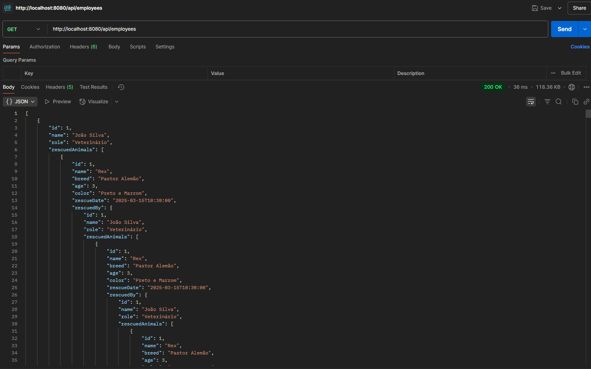
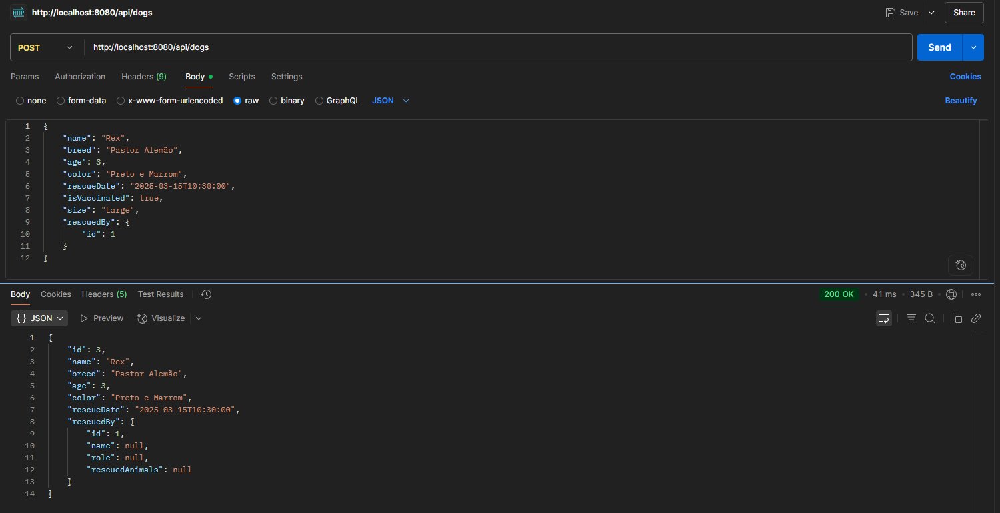

# Módulo 09 - Sistema de Gerenciamento de Abrigo de Animais
**Aluno:** Jonathan Euzébio Boza

## Sobre o Projeto
Este projeto implementa um sistema de gerenciamento para um abrigo de animais usando Spring Boot. O sistema permite o cadastro e gerenciamento de cães, gatos e funcionários, além de rastrear os resgates realizados.

## Funcionalidades
- CRUD completo para Cães e Gatos
- CRUD completo para Funcionários
- Relatório de resgates por funcionário com filtro de data

## Tecnologias Utilizadas
- Java 17
- Spring Boot 3.1.0
- Spring Data JPA
- H2 Database
- Maven

## Como Executar
1. Clone o repositório
2. Execute: `mvn clean install`
3. Execute: `mvn spring-boot:run`
4. Acesse: `http://localhost:8080`

## Endpoints e Exemplos de Uso

### 1. Gerenciamento de Funcionários

#### Criar Funcionário
```bash
curl -X POST http://localhost:8080/api/employees \
-H "Content-Type: application/json" \
-d '{
    "name": "João Silva",
    "role": "Veterinário"
}'
```

#### Listar Funcionários
```bash
curl http://localhost:8080/api/employees
```

### 2. Gerenciamento de Cães

#### Criar Cachorro
```bash
curl -X POST http://localhost:8080/api/dogs \
-H "Content-Type: application/json" \
-d '{
    "name": "Rex",
    "breed": "Pastor Alemão",
    "age": 3,
    "color": "Preto e Marrom",
    "rescueDate": "2025-03-15T10:30:00",
    "isVaccinated": true,
    "size": "Large",
    "rescuedBy": {
        "id": 1
    }
}'
```

#### Listar Cães
```bash
curl http://localhost:8080/api/dogs
```

### 3. Gerenciamento de Gatos

#### Criar Gato
```bash
curl -X POST http://localhost:8080/api/cats \
-H "Content-Type: application/json" \
-d '{
    "name": "Mia",
    "breed": "Siamês",
    "age": 1,
    "color": "Branco e Marrom",
    "rescueDate": "2025-02-10T09:45:00",
    "isNeutered": true,
    "isIndoor": true,
    "rescuedBy": {
        "id": 1
    }
}'
```

#### Listar Gatos
```bash
curl http://localhost:8080/api/cats
```

### 4. Relatório de Resgates

#### Buscar Estatísticas de Resgate
```bash
curl "http://localhost:8080/api/employees/rescue-stats?startDate=2025-01-01&endDate=2025-12-31"
```

## Estrutura do Projeto

### Modelos
- `Animal`: Classe abstrata base para animais
- `Dog`: Classe específica para cães
- `Cat`: Classe específica para gatos
- `Employee`: Classe para funcionários

### APIs REST
- `/api/dogs`: Endpoints para gerenciamento de cães
- `/api/cats`: Endpoints para gerenciamento de gatos
- `/api/employees`: Endpoints para gerenciamento de funcionários
- `/api/employees/rescue-stats`: Endpoint para relatório de resgates

## Banco de Dados
O projeto utiliza banco de dados H2 em memória. Console disponível em:
- URL: `http://localhost:8080/h2-console`
- JDBC URL: `jdbc:h2:mem:shelterdb`
- Usuário: `sa`
- Senha: `password`

## Screenshots

### Exemplos de Requisições




---
Desenvolvido como parte do curso de Especialista Back-end Java da EBAC.
