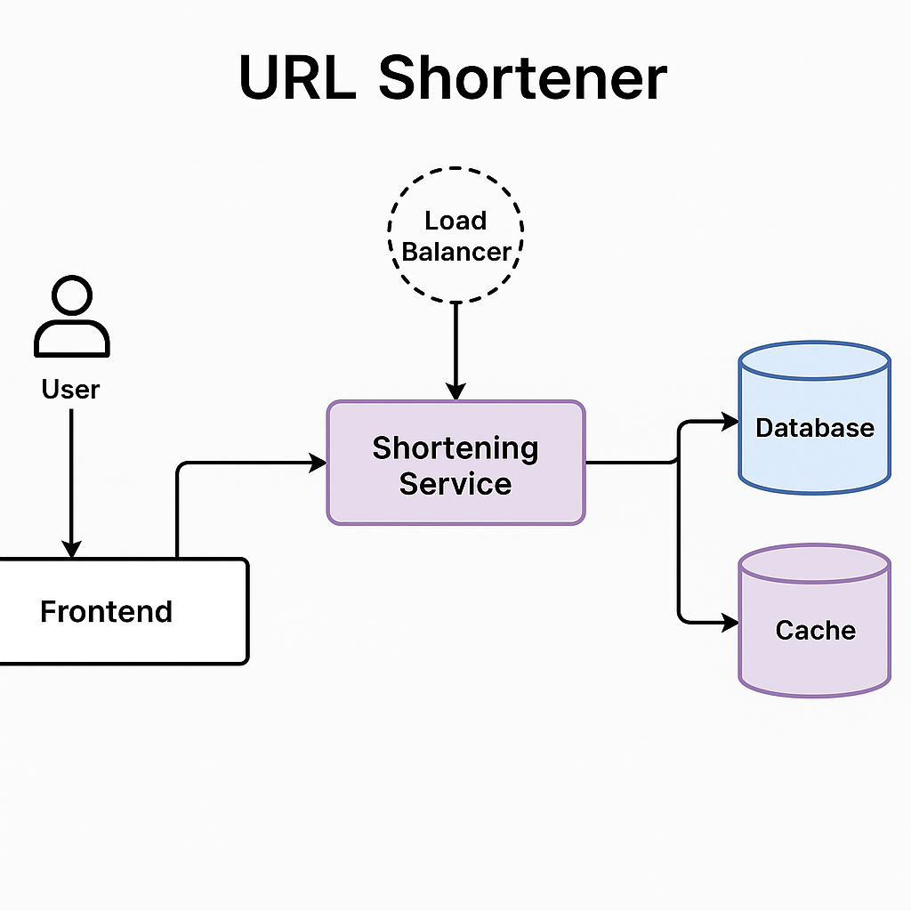

# Módulo 14 – Microsserviço Encurtador de URL

Este material foi desenvolvido como parte do curso **Backend Java Especialista** da EBAC por **Jonathan Euzébio Boza**.

## 🎯 Objetivo

Apresentar um diagrama de arquitetura de um sistema de **encurtador de URLs** utilizando conceitos modernos de **microsserviços**.

## 🧱 Tecnologias e Conceitos Utilizados

- Java (conceitualmente)
- Spring Boot (conceitualmente)
- Microsserviços
- REST API
- Banco de dados
- Comunicação HTTP entre serviços

## 🗂️ Diagrama de Arquitetura

A imagem abaixo representa a arquitetura geral do sistema:

## 📌 Funcionalidades Representadas

- Serviço de encurtamento de URLs
- Serviço de redirecionamento
- Banco de dados para armazenar os mapeamentos
- API Gateway (opcional)
- Comunicação via HTTP entre os serviços

## 👤 Autor

**Jonathan Euzébio Boza**  
Curso: Backend Java Especialista – EBAC  
Módulo: 14
